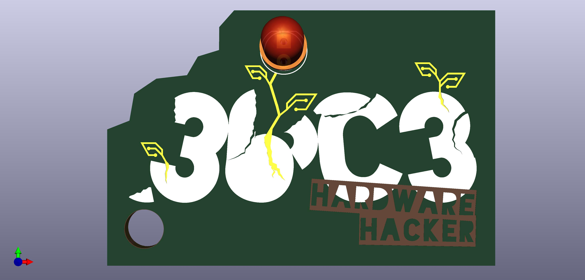
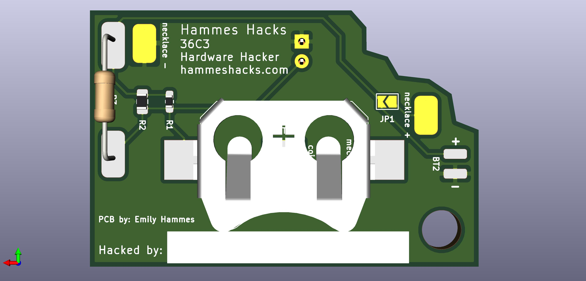
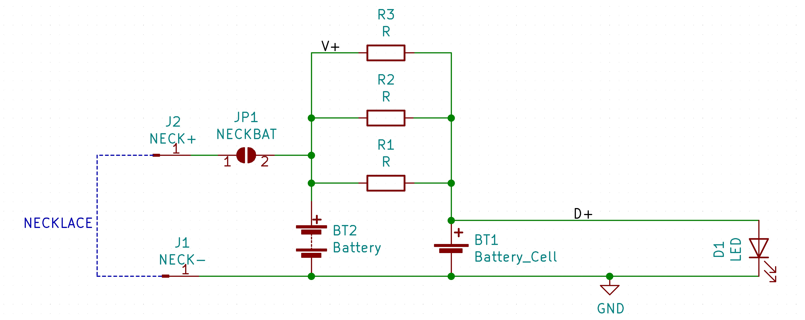
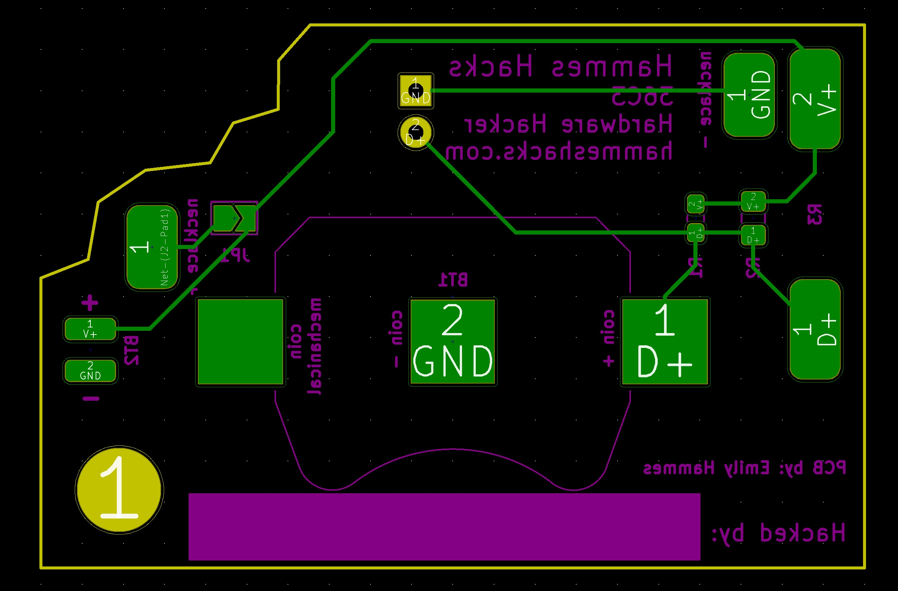

# 36C3 Hardware Hacker

## Inspiration
I wanted an I can solder badge that could be used in multiple ways. 

## Introduction
The 36C3 Hardware Hacker is a PCB which tells the world that you can solder, hack and went to 36C3. It can be worn / used in a ton of ways:
* As a necklace
* As a pin
* As a key chain
* As a breakout board to another badge
* Bolted to something
* Hot glued to a clothes pin
* ...

It can be powered in a few ways:
* A coin cell (CR2032)
* A battery pack
* A pin header attaching it to another board. 

## Theory
The board can power the LED using 3 Different sets of pads:

### The Coin Cell Pads:

If you power the LED using the Coin Cell pads, the battery connects directly to the LED. No resistors are needed. 

### The Pin Header Pads:
If you power the LED using the pin header pads, you also need to add a resistor to close the circuit with the LED. The resistors are in parallel, the smallest is an 0603, the bigger small one is an 0805 and the last is for a through hole resistor. Because the resistors are in parallel, you only need to solder 1 to the board. 

### The Necklace Pads:    
One of the necklace pads is always connected to ground. The other pad can optionally be connected to the positive side of a battery. If you want to power the 36C3 Hardware Hacker over the necklace wires you need to connect the left pad to the positive side of the battery/voltage source. To do this, you connect the jumper by placing a blob of solder on both of the pads, so that they are bridged. You also need to populate one of the resistors to close the circuit. 

Note: if you want to power the board using the pin header pads or the coin cell pads and wear it as a necklace, just do not short the jumper and solder a wire between the two necklace pads. 

## Selected Assembly Variants:

### Key Chain:

#### Materials:
* 36C3 Hardware Hacker PCB

#### Directions:
Attach to Key Chain.

### Pin:

#### Materials:
* 36C3 Hardware Hacker PCB
* Coin Cell Holder
* Coin Cell
* LED
* Magnet

#### Directions:
1. Solder the coin cell holder on
2. Solder the LED on
3. Put in battery (facing the right way)
4. Attach to clothes with a magnet

### Necklace (coin cell on board):

#### Materials:
* 36C3 Hardware Hacker PCB
* Coin Cell Holder
* Coin Cell
* LED
* Wire

#### Directions:
1. Solder the coin cell holder on
2. Solder the LED on
3. Put in battery (facing the right way)
4. Solder a wire on and use it as the necklace chain

### Necklace Variant 2 (Coin Clasp powered):

#### Materials:
* 36C3 Hardware Hacker PCB
* Coin Clasp
* Coin Cell (CR2032)
* LED
* Wire
* Resistor (can be 0 ohm or just a wire for CR2032)

#### Directions:
1. Use solder to bridge the jumper.
2. Solder a resistor onto the board
3. Solder the LED on
4. Attach the positive side of the battery wire to the positive necklace pad
5. Attach the negative side of the battery wire to the negative necklace pad

### Necklace Variant 3 (powered by 3 AAA batteries):

#### Materials:
* 36C3 Hardware Hacker PCB
* Battery holder
* Batteries
* LED
* Wire
* Resistor (do not use a 0 ohm resistor)

#### Directions:
1. Use solder to bridge the jumper.
2. Solder a resistor onto the board
3. Solder the LED on
4. Attach the positive side of the battery wire to the positive necklace pad
5. Attach the negative side of the battery wire to the negative necklace pad

### Other Badge Mod:

#### Materials:
* 36C3 Hardware Hacker PCB
* Badge from another event
* LED
* Resistor (do not use a 0 ohm resistor)
* Wire 
* Screw, hot glue, epoxy etc.

#### Directions:
1. Solder the LED on
2. Solder a resistor onto the board
3. Solder the positive pin header pin to the positive voltage on the other badge
4. Solder the negative pin header pad to the ground on the other badge
5. Glue, Screw etc. the badges together. 

## Whats Inside the PCB?

This is the schematic of the PCB, showing how all the components are connected.

Above is a transparent view of the PCB. Green lines are wires on one side and red lines are wires on the other side of the PCB. The text that will be printed on the board is in magenta on one side and teal on the other. The yellow line is the edge of the board. The gold circles are drilled through the board and have copper on both sides. 

## Data Sheets
