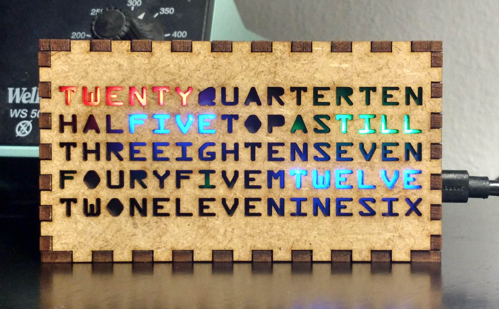
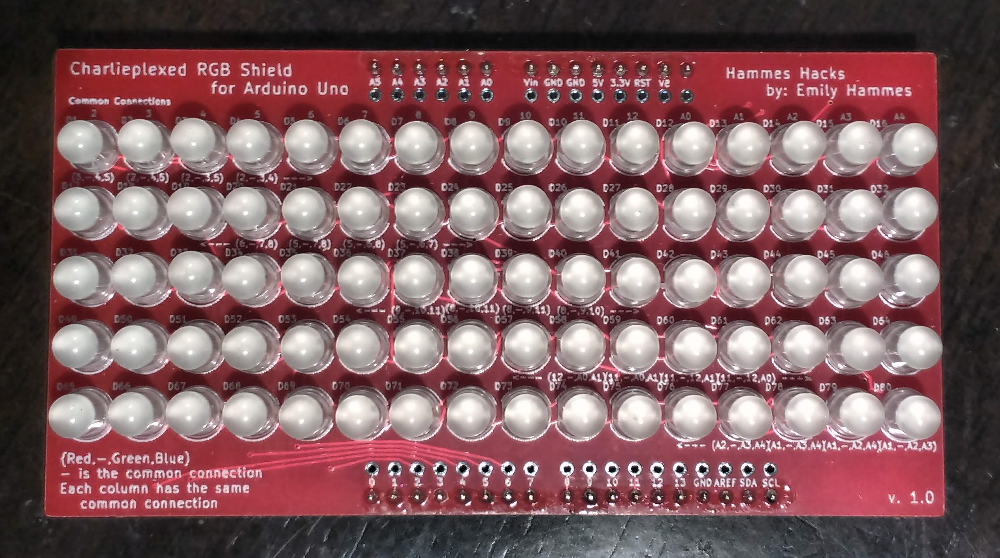

# Word Clock

# Introduction
The word clock is a clock where the time is spelled out in five minute incriments. The letters are illuminated by my Charlieplexed RGB Shield. The LEDs are driven by an Arduino Uno. Because the shield is charliplexed, each LED is individually controlable. 

# Background
The basics of charlieplexing--which is the method I am using to individually control each LED--is found in this video: 

Charlieplexing with Red Green and Blue (RGB) LEDs adds another level of complexity to the process. More information can be found in this video :

<iframe id="ytplayer" type="text/html" width="640" height="360" src="https://www.youtube.com/embed/AYV717iQsXo?autoplay=0&origin=http://hammeshacks.com" frameborder="0" allowfullscreen></iframe>

# Assembly

## Parts List
  * 1 Hammes Hacks Charlieplexed RGB Shield for Arduino Uno
  * 1 Arduino Uno
  * 1 Laser cut case
  * 16 110 ohm resistors
  * 80 common cathode RGB LEDs
  * Pin headders
  * USB cable
  * Wood glue or white glue
  * Soldering iron
  
## Soldering the Shield
  1. Solder all 16 resistors onto the PCB
  2. Solder 1 pin on each LED to the board
  3. Align the LEDS so that they are streight
  4. Solder all other pins on the LEDS
  5. Using a bright light shine light through the PCB to visually check all the solder joints on the LEDs for shorts. To do this, place the plastic part of the LED toward the light and look at each solder joint. Each LEDs solder joints should look like a rectangle, next to three ovals. If you can see light through the oval or the rectangle then add a little solder to that joint. If two of the joints are shorted (soldered together) then remove a little solder until the solderjoints are distinct. 
  6. (optional) add button/wires/switch for timesetting
  7. Add pin headders
  
## Glueing the Case 
  Glue together the case using standard wood glue or white glue. While doing so, note the following:
  * One side of the case may have marks or soot from the laser cutting process. Put these on the inside of the case. 
  * Make sure that the back of the case and the front of the case are in the correct places: the X should be on the bottom right of the case and the part of the back piece which is missing teeth should be just behind it. 
  * Do not glue the side of the box where the USB cables come out (it is the side with Hammes Hacks on it). This will allow you to get into the electronics later.
  Additionally, it is often helpful to hold the box together with rubbber bands while it is drying. 

# Uploading Code
Once you are done soldering, it is time to upload code. 

## Debugging
  Before uploading the word clock code, it is best to upload the test code. This code will make one pin high and another low so that only 1 LED will light up either red, green or blue at a given time. Most likely, even though we optically checked for shorts, there will still be one on the board. To repair them do the following:
  * If multiple LEDs do not light up, check the resistors. When a resistor is not soldered, then all the LEDs connected to that pin will not work. 
  * If 2 LEDs are lighting up at the same time, two pins are shorted somewhere. Look for the LED that does not light up, that is probabily where the short is. For example, a short between red and ground on LED 32 is a short between pin 6 and 3. This will cause LED 21 to not light up green. It will also cause many diodes pairs such as 1 and 17 (both red), and 3 and 19 (green and red respectively) to be on at the same time.
  
## Uploading Final Code
Once the shield is debugged, upload the word clock code.
