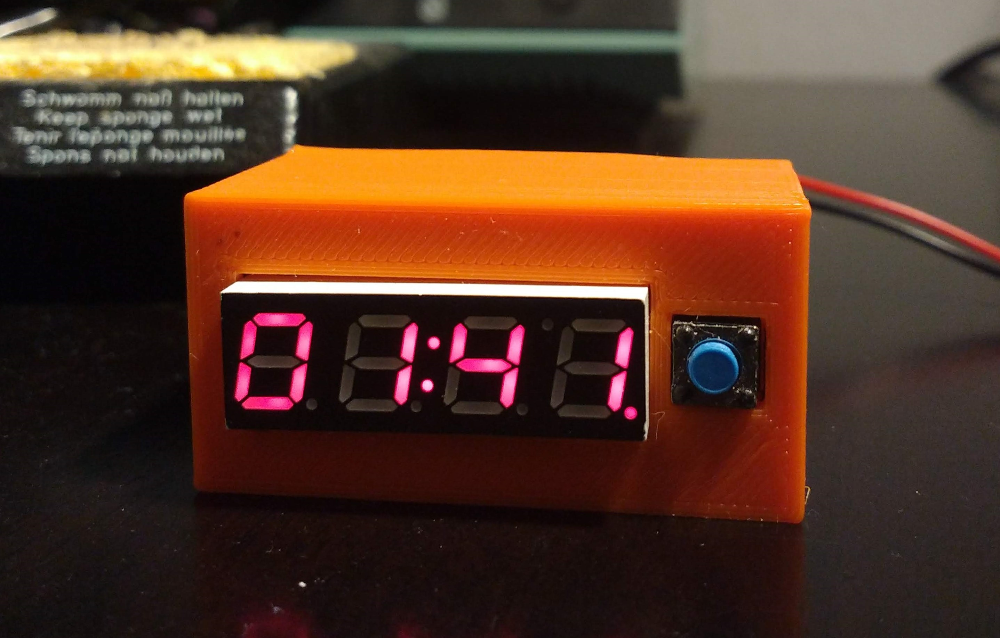
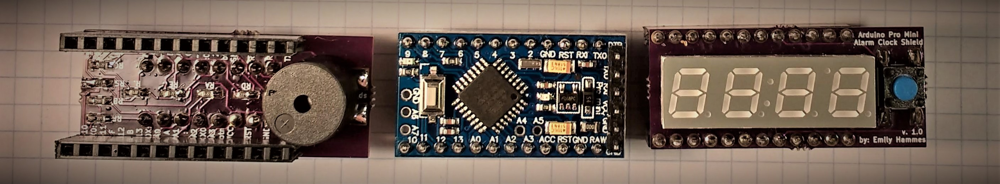

# Alarm Clock

# Theory

How 7 segment displays work:

<iframe id="ytplayer" type="text/html" width="640" height="360"
  src="https://www.youtube.com/embed/ZrYyVWv4Ff8?autoplay=0&origin=http://hammeshacks.com"
  frameborder="0" allowfullscreen></iframe>

How buttons work:

<iframe id="ytplayer" type="text/html" width="640" height="360"
  src="https://www.youtube.com/embed/C5elus14muQ?autoplay=0&origin=http://hammeshacks.com"
  frameborder="0" allowfullscreen></iframe>

# Assembly

## Parts List
  
  * LTC-2623 4 digit 7 segment display
  * 9 220 ohm resistors
  * Buzzer or speaker
  * Female pin headers
  * Arduino Pro Mini
  * PCB
  
## Soldering the Shield

  1. Solder the resistors onto the PCB.
  2. Solder the button onto the PCB.
  3. Solder the 7 segment display onto the PCB so that decimal places on the display are on the "by: Emily Hammes" side. 
  4. Bend the leads to a 90 degree angle and solder the speaker onto the board.
  5. Solder the pin headers onto the board.
  6. Plug the board into the Arduino Pro Mini so that the program header is above the speaker on the alarm clock shield.
  
## Printed Case
  
  
