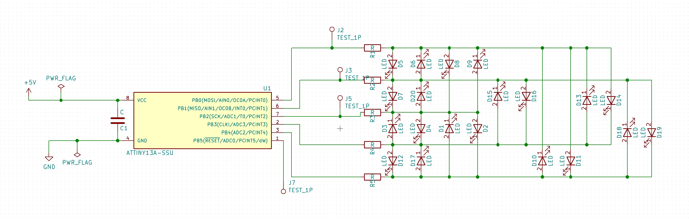
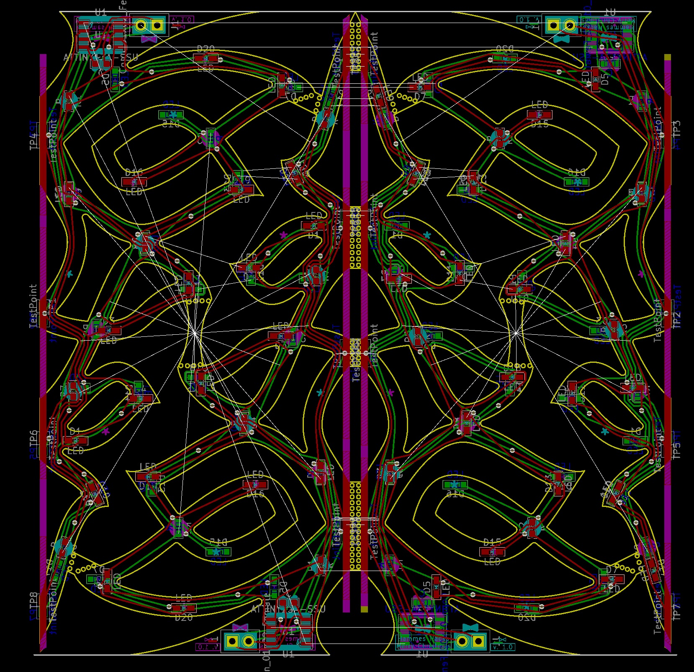

# Celtic Christmas

## Inspiration
I have a tiny apartment and it needed a matching Christmas tree. 

## Introduction
The Celtic Christmas kit is 4 PCBs built on a single board which break appart and are soldered into a 3D celtic knot shapped like a christmas tree. 

## Theory
Each of the 4 PCBs contain the same circut. Actually, it is the same circut and program as the heart, dragonfly and shamrock. Specifically, there are 4 Attinys wich each controll 20 LEDs which blink independantly. The LEDs are controlled by charlieplexing.

For more information on charlieplexing watch this video:

<iframe id="ytplayer" type="text/html" width="640" height="360" src="https://www.youtube.com/embed/Bx5GLyJSWPk?autoplay=0&origin=http://hammeshacks.com" frameborder="0" allowfullscreen></iframe>

## Assembly:

<iframe id="ytplayer" type="text/html" width="640" height="360" src="https://www.youtube.com/embed/SsWLh_3IS_c?autoplay=0&origin=http://hammeshacks.com" frameborder="0" allowfullscreen></iframe>

### Materials:
* 80 0603 LEDs: 32 of one color, 48 in another.
* 20 0603 110 ohm resistors
* 4 Attiny13As
* 4 0603 capacitors
* 3.3 to 5V power (batteries/USB etc.)
* (optional) 1 throughhole LED, to use as a star.
* (optional) 2 0603 resistors which make the throughhole LED the correct brightness.

### Soldering the tree:
1. Break the PCB into 3 parts: 2, 5 by 10 cm triangles; 1, 10 x 10 cm triangle. 
2. Solder all the 0603 components on one side of the PCB before beginning with the other. This makes it easier to flip the board over and solder the other side. 
	* The lower 5 balls get resistors,
	* The bow has a capacitor on it
	* The horizontal pad pairs get LEDs
	* The vertical pad pairs get the other color of LEDs.
	* For the titled pads look at the figure
	
3. Solder the 0603 components on other side of each PCB
4. If you want to add a star to the tree, solder the two top resistors on one of the 5x10 cm triangles. This will make one side of the PCB + and the other - on this PCB. DO NOT DO THIS FOR ALL ARMS BECAUSE YOU WILL DRAMATICALY INCREASE THE POWER CONSUMPTION OF THE KIT.
5. Solder the Tinys. These must be the correct orientation. Note the pink dots in the image.
6. Solder the power cable
7. Soler the PCBs at right angles to eachother so that you have a tree. 
8. Turn the tree on and make sure that power and ground have a very high resistance. If they do, this is because you soldered all the resistors for the star and not just one set. 

## Whats Inside the PCB?

This is the schematic of the PCB, showing how all the components are connected.

Above is a transparent view of the PCB. Green lines are wires on one side and red lines are wires on the other side of the PCB. The text that will be printed on the board is in magenta on one side and teal on the other. The yellow line is the edge of the board. The gold circles are drilled through the board and have copper on both sides. 
