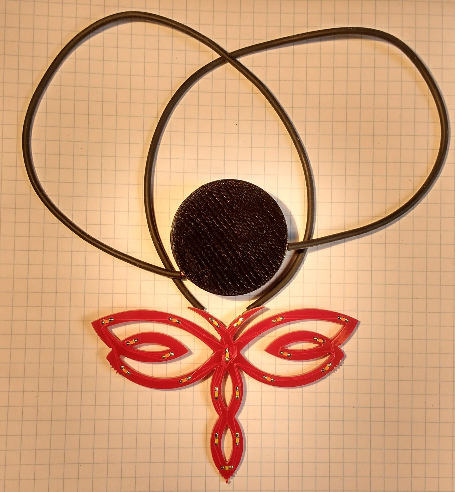
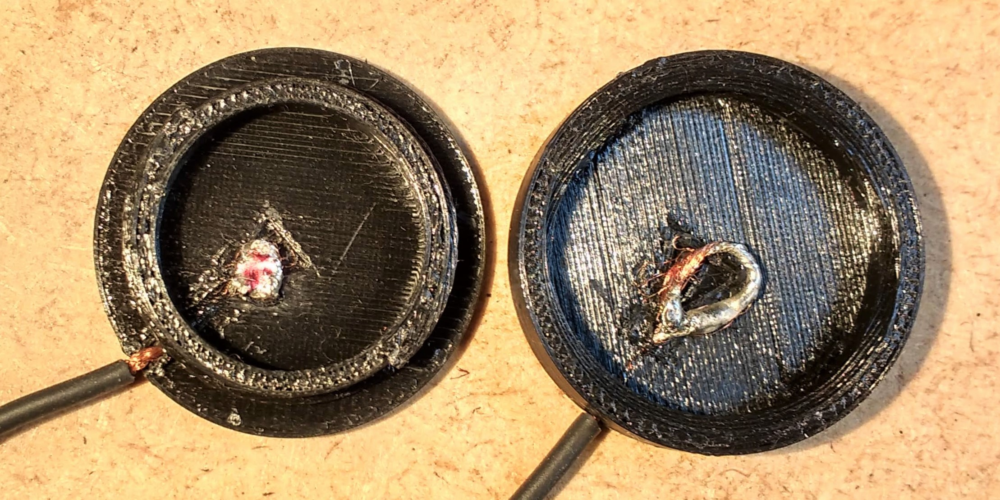

# Coin Cell Necklace Clasp

 
## Materials

  * 3D printer 
  * CR2032 battery
  * Wire
  * Electronic pendant such as a [snowflake](http://hammeshacks.com/snowflake/), [heart](http://hammeshacks.com/tinyheart/), [dragonfly](http://hammeshacks.com/dragonfly/) or [shamrock](http://hammeshacks.com/shamrock/).
  * Solering iron and solder

## Assembly

  
  
  1. Print both sides of the clasp.
  2. Cut the wire into 2 equal length pieces.
  3. Strip both ends of the wire.
  4. Thread the wires through the 3D printed parts.
  5. Make a loop out of the wire inside the 3D printed part and place a blob of solder on it. This will keep the wire in the plastic and act as a contact for the battery.
  6. Solder the other ends of the wires to the positive and negative sides of the electric pendant.
  7. Use a black and/or red perminant marker and mark the blob of solder inside the coin holder with the positive and/or negative sides of the pendant. This will make it much easier to figure out which way the battery goes later.
  8. Put the battery in with the + side on the red/positive wire and the - side on the black/ground side of the wire.
  
## Files

 * [Part1](coin1.stl)
 * [Part2](coin2.stl)
