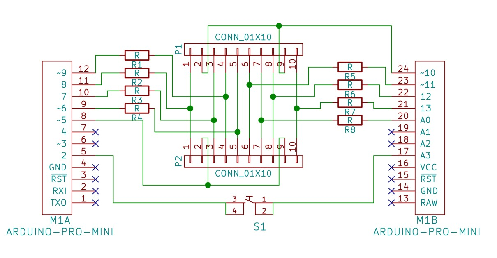
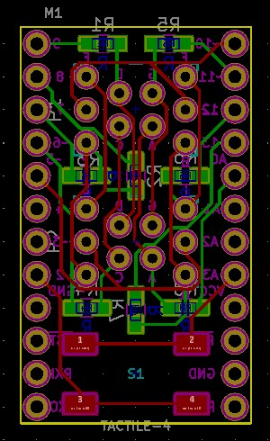

# Minidice
<iframe id="ytplayer" type="text/html" width="640" height="360"
  src="https://www.youtube.com/embed/T_dfoYWEm8U?autoplay=0&origin=http://hammeshacks.com"
  frameborder="0" allowfullscreen></iframe>

## Introduction
The Minidice Shield contains two eight segment numeric displays, which represent the 2 dice faces. This shield plugs into an  Arduino Promini or Promicro. By controlling the state of the pins, all the segments in both dice can be individually turned on or off to display the numbers 0 to 9. By using a random number generator we can simulate rolling 2 dice.

## Theory
Seven segment displays are simple to control: 

<iframe id="ytplayer" type="text/html" width="640" height="360"
  src="https://www.youtube.com/embed/ZrYyVWv4Ff8?autoplay=0&origin=http://hammeshacks.com"
  frameborder="0" allowfullscreen></iframe>
  
## Soldering The Shield
<iframe id="ytplayer" type="text/html" width="640" height="360"
  src="https://www.youtube.com/embed/T7TJJyWkgUs?autoplay=0&origin=http://hammeshacks.com"
  frameborder="0" allowfullscreen></iframe>

### Materials
  * 8 resistors
  * 2 eight segment displays (LTS2801AC)
  * 1 button
  * 2 female pin headers
  
### To solder the shield follow these steps:

  1. Solder the resistors.
  2. Solder the eight segment displays.
  3. Solder the button.
  4. Soler the pin headers.

### Uploading Code 

* Download the [Arduino software](https://www.arduino.cc/en/Main/Software)
* Select Arduino Uno under Tools > Baord in the Arduino software
* Select the correct comport under Tools > Port in the Arduino software
* Download the code [from github](https://github.com/emilyhammes/minidice) and upload it to the Arduino.

### Whats Inside the PCB?

This is the schematic of the PCB, showing how all the components are connected.

This is a transparent view of the PCB. Green lines are wires on one side and red lines are wires on the other side of the PCB. The text that will be printed on the board is in magenta on one side and teal on the other. The yellow line is the edge of the board. The gold circles are drilled through the board and have copper on both sides. 