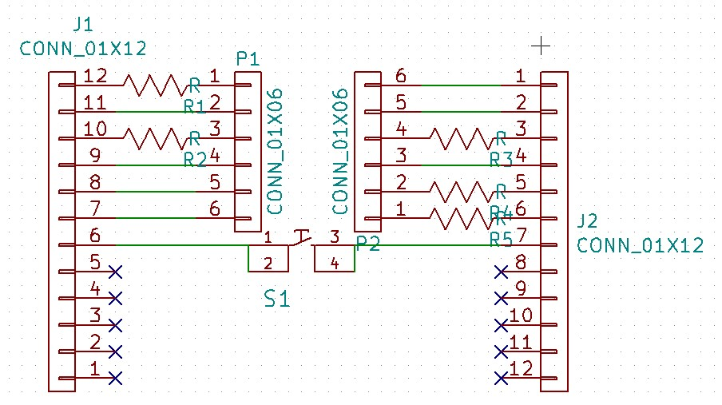
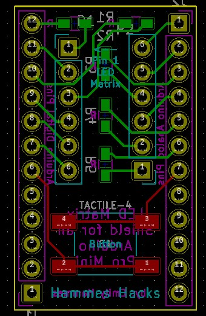

# Minipong

## Note:
The code that is currently online is for an Arduino Pro Micro not an Ardino Pro Mini. It does not work with the 35C3 kit, because the pin numbers will need to be changed. I will upload a Pro Mini version in the next few days. 

I just tested it. Change the lines at the top of the Pro Micro Code so that they are:

 //for simplicity the pins are given variable names so that it is easier to understand which light should turn on.
const int col1 = 9 ; //column 1 is on pin 1...this is 1 in the data sheet
const int col2 = 7 ; //column 2 is on pin 3
const int col3 = 14; //column 3 is on pin 10
const int col4 = 19 ; //column 4 is on pin 7
const int col5 = 18; //column 5 is on pin 8
const int row1 = 10 ; //row 1 is on pin 12
const int row2 = 16 ; //row 1 is on pin 11
const int row3 = 8 ; //row 1 is on pin 2
const int row4 = 15 ; //row 1 is on pin 9
const int row5 = 6 ; //row 1 is on pin 4
const int row6 = 5 ; //row 1 is on pin 5
const int row7 = 4 ; //row 1 is on pin 6

<iframe id="ytplayer" type="text/html" width="640" height="360"
  src="https://www.youtube.com/embed/zE6a-TzRJhY?autoplay=0&origin=http://hammeshacks.com"
  frameborder="0" allowfullscreen></iframe>

## Introduction
The Minipong Shield contains an 5x7 matrix and plugs into an Arduino Promini or Promicro. By controlling the state of the pins all LEDs can be individually turned on or off and patterns can be controlled.

## Theory
Lets start with the theory for a single color multiplexed matrix: 

<iframe id="ytplayer" type="text/html" width="640" height="360"
  src="https://www.youtube.com/embed/jLnLXc81mwI?autoplay=0&origin=http://hammeshacks.com"
  frameborder="0" allowfullscreen></iframe>
  
## Soldering The Shield

  <iframe id="ytplayer" type="text/html" width="640" height="360"
  src="https://www.youtube.com/embed/gNtDyXgn8oI?autoplay=0&origin=http://hammeshacks.com"
  frameborder="0" allowfullscreen></iframe>
  
### Materials
  * 5 resistors
  * 1 LED matrix (LTP747 or 757AS)
  * 1 button
  * 2 female pin headers
  
### To solder the shield follow these steps:
  1. Solder the resistors.
  2. Solder the matrix (for the LTP747 the text is on the oppostite side from pin 1, for the 757AS the text is on the same side as pin 1).
  3. Solder the button.
  4. Soler the pin headers.

### Building the Case
1.	Glue all sides of the case together except the back.
2.	Wait for glue to dry. rubber bands can be used to hold the case together while it dries).
3.	Plug the shield into the Arduino.
4.	Place the shield and Arduino into the case.
5.	Close the case. Friction and the cables should hold the unglued side in place.

### Uploading Code 

* Download the [Arduino software](https://www.arduino.cc/en/Main/Software)
* Select Arduino Uno under Tools > Baord in the Arduino software
* Select the correct comport under Tools > Port in the Arduino software
* Download the code [from github](https://github.com/emilyhammes/minipong-promicro/archive/master.zip) and upload it to the Arduino.

### Whats Inside the PCB?

This is the schematic of the PCB, showing how all the components are connected.

This is a transparent view of the PCB. Green lines are wires on one side and red lines are wires on the other side of the PCB. The text that will be printed on the board is in magenta on one side and teal on the other. The yellow line is the edge of the board. The gold circles are drilled through the board and have copper on both sides. 
