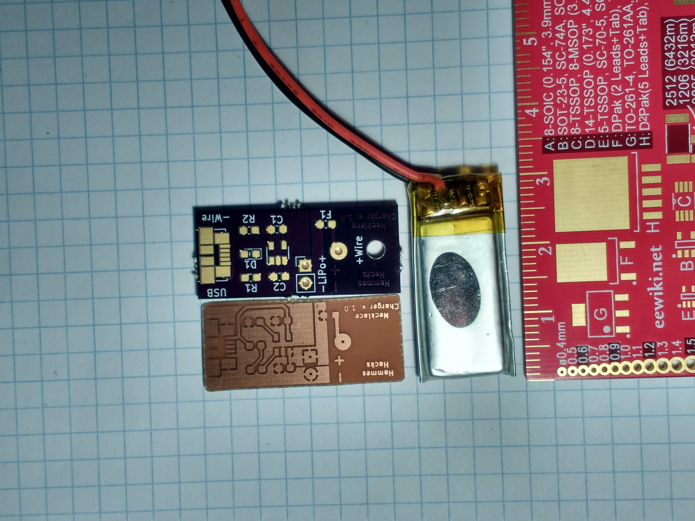
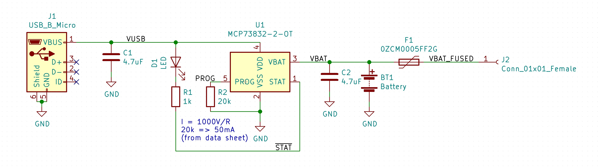

# Necklace Charger
The necklace charger uses a rechargable battery and wires to turn a small PCB into a piece of jewelry. The clasp contains a battery and a recharge circut and each side of the chain is either a positive or ground wire.
  
# Introduction
One wire (male USB) contains only ground while the other wire contains the positive voltage line. A circuit (tiny heart, tiny snowflake, shamrock, dragonfly etc.) is placed between the two wires. The positive side of the clasp also contains a LiPo battery and a PCB with a recharge circut. The battery is recharged by unplugging/unclasping the necklace and pluging the positive side of the clasp into a cell phone/usb charger.

# PCB Assembly

## Component List
  * C1 : 4.7 uF
  * D1 : 0603 LED
  * R1 : 1k
  * R2 : 20K
  * C2 : 4.7uF
  * F1 : Fuse
  * LiPo : 041230 LiPo Battery
  * Wire : USB cable
  * Chip : [Microchip MCP73832/2](http://ww1.microchip.com/downloads/en/DeviceDoc/20001984g.pdf)
  * USB micro B female connector

## Soldering
  1. Solder the USB micro B female connector. Check for shorts between the positive and ground pins. This can be checked by using a multimeter and touching the C side of C1 (+5V) and the metal part of the connector or the 1 side of C1 (Ground).
  2. Solder the chip 73832/2 and check for shorts.
  3. Solder the passive components (resistors, capacitors, LED and fuse). Only the LED has a direction. The D side of D1 pad pair gets the low voltage side of the LED.
  4. Cut the USB cable in half and strip the ends of the wires. You should end up with a piece of wire which has noting attached and a wire of equal length with a male USB micro B connector. The red wire should be kept on the wire with nothing, the black wire should be kept on the wire with the USB still attached. Other wires can be trimmed off because they will not be used. 
  5. Thread the postive wire through the +Wire hole and solder it to the pad
  6. Solder the + (red) and - (black) sides of the LiPo battery to the PCB.
  7. Solder the end of the + wire to the + side of a [snowflake](http://hammeshacks.com/snowflake/), [heart](http://hammeshacks.com/tinyheart/), [dragonfly](http://hammeshacks.com/dragonfly/) or [shamrock](http://hammeshacks.com/shamrock/).
  8. Solder the black wire at the end of the USB micro B connector to the negative side of the snowflake, heart, dragonfly or shamrock. 
  9. Confirm that the LiPo battery charges correctly and discharges correctly.
  10. Use heat shrink tubing to protect the battery and circut.

### Whats Inside the PCB?

This is the schematic of the PCB, showing how all the components are connected.

This is a transparent view of the PCB. Green lines are wires on one side and red lines are wires on the other side of the PCB. The text that will be printed on the board is in magenta on one side and teal on the other. The yellow line is the edge of the board. The gold circles are drilled through the board and have copper on both sides. 
