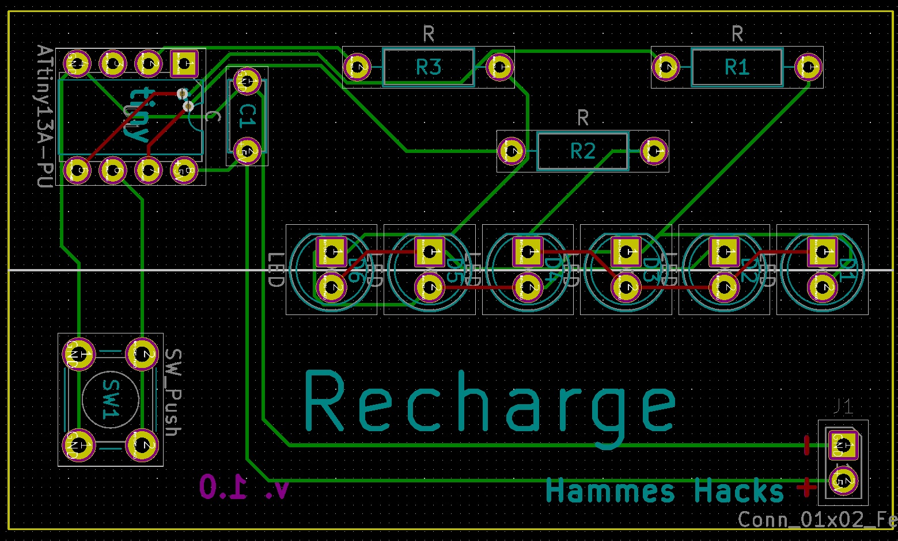

# Recharge

## Inspiration

This kit was inspired by Markus, a collegue at my local hackspace. Origionally, he devloped an analog circut which looks very similar to this kit. At about the same time, I was giving a workshop in Zurich, and many parents wanted a 15 minute through hole only kit.  With the fusion of these ideas, the Recharge kit was born. 

## Theory

The kit uses a set of charlieplexed LEDs and a button to controll them. Pressing the button wakes up the microcontroller, and the longer the button is held, the more LEDs light up. Once the maximum brighness of the last LED is reached, it begins blinking. 

For more information on how charlieplexing works:

<iframe id="ytplayer" type="text/html" width="640" height="360" src="https://www.youtube.com/embed/Bx5GLyJSWPk?autoplay=0&origin=http://hammeshacks.com" frameborder="0" allowfullscreen></iframe>

For more information on how buttons work:

<iframe id="ytplayer" type="text/html" width="640" height="360" src="https://www.youtube.com/embed/C5elus14muQ?autoplay=0&origin=http://hammeshacks.com" frameborder="0" allowfullscreen></iframe>

## Assembly
### Components
* 6 5mm LEDs
* 3 Resistors
* 1 button
* 1 Attiny 13
* 1 3AAA battery holder
* 1 capacitor
* 3 AAA batteries (not included)

### Directions
1. Solder the resistors.
2. Solder the microcontroller making sure that it has the correct orientation.
3. Solder the capacitor.
4. Solder the Button.
5. Solder the LEDS.
6. Trim the leads on the battery holder to length and solder the battery holder. It is important that the wires on the battery holder. are long enough that the batteries can be easily replaced. 
7. Add batteries and check the circut.
8. If the circut is ok, hot glue the PCB onto the battery holder.

## Uploading Code

Code comes preuploaded in the kit.

## Whats Inside the PCB?

This is the schematic of the PCB, showing how all the components are connected.

Above is a transparent view of the PCB. Green lines are wires on one side and red lines are wires on the other side of the PCB. The text that will be printed on the board is in magenta on one side and teal on the other. The yellow line is the edge of the board. The gold circles are drilled through the board and have copper on both sides. 

