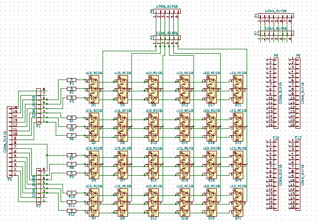
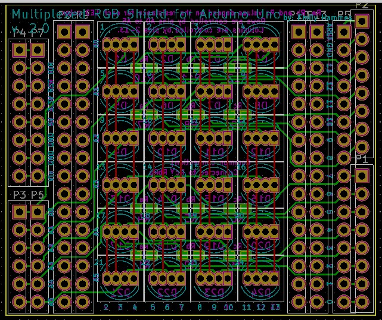

# Multiplexed RGB LED Shield
## Introduction
The Multiplexed RGB Shield contains 24 RGB LEDs in a 4x6 matrix and plugs into an Arduino Uno. By controlling the state of the pins all LEDs can be individually turned on or off and their colors can be controlled.

## Theory
To understand how multiplexing works, it is easiest to start with the theory for a single color multiplexed matrix: 

<iframe id="ytplayer" type="text/html" width="640" height="360"
  src="https://www.youtube.com/embed/jLnLXc81mwI?autoplay=0&origin=http://hammeshacks.com"
  frameborder="0" allowfullscreen></iframe>
  
Multiplexing with RGB LEDs is basically the same as monochrome multiplexing with some small differences:
  <iframe id="ytplayer" type="text/html" width="640" height="360"
  src="https://www.youtube.com/embed/jQYGCGH9bMM?autoplay=0&origin=http://hammeshacks.com"
  frameborder="0" allowfullscreen></iframe>
  
## Soldering The Shield
  <iframe id="ytplayer" type="text/html" width="640" height="360"
  src="https://www.youtube.com/embed/OaYhBevXBYk?autoplay=0&origin=http://hammeshacks.com"
  frameborder="0" allowfullscreen></iframe>
  
### Materials
  * 12 resistors
  * 24 RGB LEDs
  * male pin header
  
### To solder the shield follow these steps:
  1. Solder the resistors.
  2. Cut the leads on all of the LEDs to 2.5-3mm.
  3. Solder 1 side of each of the LEDs, making sure that the flat side of the LED matches the flat side on the silkscreen. I usually do the Square pin first.
  4. Align the LEDs by remelting the solder and moving the LED into place.
  5. Once aligned, solder the other pins on the LEDs. 
  6. Solder cut and solder the pin header.
  
  Note: Some people like to leave the leads long and bend them to hold them in place before soldering. Then they trim them after soldering. This is not recommended for this project because it makes alignment and replacement of LEDs difficult or impossible.

### Building the Case
1.	Glue all sides of the case together except the one with the connector for the Arduino (the one with hammes hacks engraved in it).
2.	Wait for glue to dry. rubber bands can be used to hold the case together while it dries).
3.	Plug the shield into the Arduino.
4.	Slide the shield and Arduino into the case.
5.	Place transparent plastic between the Arduino shield and the top of the case.
6.	Close the case. Friction and the cables should hold the unglued side in place.

### Uploading Code 
<iframe id="ytplayer" type="text/html" width="640" height="360"
  src="https://www.youtube.com/embed/ZdOZB8iYkNo?autoplay=0&origin=http://hammeshacks.com"
  frameborder="0" allowfullscreen></iframe>
<iframe id="ytplayer" type="text/html" width="640" height="360"
  src="https://www.youtube.com/embed/RqE0sPx6IlQ?autoplay=0&origin=http://hammeshacks.com"
  frameborder="0" allowfullscreen></iframe>

* Download the [Arduino software](https://www.arduino.cc/en/Main/Software)
* Select Arduino Uno under Tools > Baord in the Arduino software
* Select the correct comport under Tools > Port in the Arduino software
* Download the code [from github](https://github.com/emilyhammes/rgb_matrixcodes/archive/master.zip) and upload it to the Arduino.

### Whats Inside the PCB?

This is the schematic of the PCB, showing how all the components are connected.

This is a transparent view of the PCB. Green lines are wires on one side and red lines are wires on the other side of the PCB. The text that will be printed on the board is in magenta on one side and teal on the other. The yellow line is the edge of the board. The gold circles are drilled through the board and have copper on both sides. 
