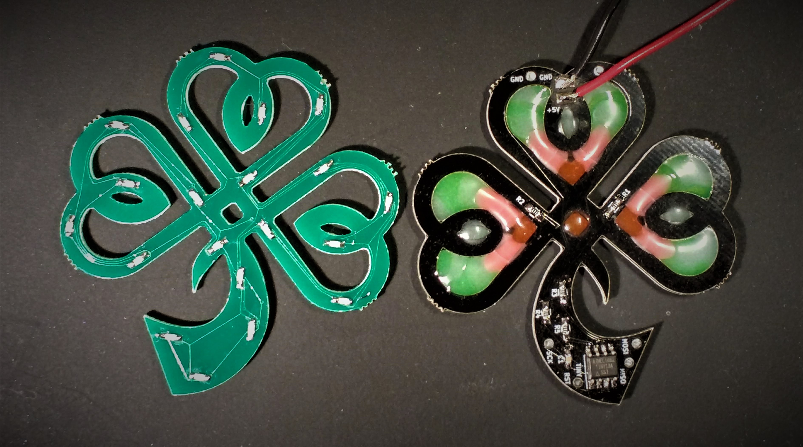
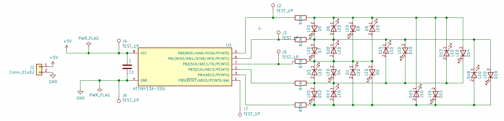
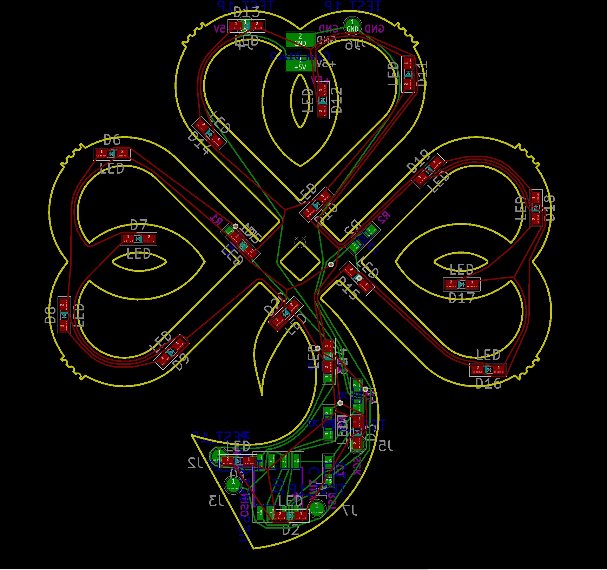

# Shamrock
<iframe id="ytplayer" type="text/html" width="640" height="360"
  src="https://www.youtube.com/embed/7g4RH2GMPGw?autoplay=0&origin=http://hammeshacks.com"
  frameborder="0" allowfullscreen></iframe>

## Introduction
The Shamrock is a PCB-Celtic knot shaped like a shamrock with 20 LEDs. The LEDs are intependantly controlled by an ATTINY 13 using charlieplexing. Code is uploaded to the device with AVR dude using a Bus Pirate, a AVRisp mk II or similar. It is not arduino compatable. It comes pre-programmed in the kit.

## Theory
<iframe id="ytplayer" type="text/html" width="640" height="360"
  src="https://www.youtube.com/embed/Bx5GLyJSWPk?autoplay=0&origin=http://hammeshacks.com"
  frameborder="0" allowfullscreen></iframe>
  
## Embedding Plastic
<iframe id="ytplayer" type="text/html" width="640" height="360"
  src="https://www.youtube.com/embed/kOk-2FF_amk?autoplay=0&origin=http://hammeshacks.com"
  frameborder="0" allowfullscreen></iframe>

Embedding plastic makes the PCBs to look like stained glass windows during the day. It is pretty, but I have not managed to find a flame retardant plastic source. This makes the plastic not suitable for electronics use. Therefore, I have not included plastic in the kits. However, given that I am living in a country where people put actual candels on actual pine trees at Christmas, I am not really worried about adding another fire hazard to my tree. I am including these directions so that you can create this fire hazard at your own risk.
  
### Materials
  * 3D printer plastic cut into small pieces (I usually use a transparent PET)
  * aluminum foil
  * unassembeled PCB
  * oven
  * cookie sheet
  * tweezers

### Melting the Plastic
Preheat oven to the temperature reccomended for the 3D printer plastic. Place a piece of perfectly flat aluminum foil onto the cookie sheet. Place the PCB onto the aluminum foil. Using tweezers, put pieces of 3D printer plastic into the empty spaces in the PCB making sure that none of the pieces are touching the pads of the PCB. Once the plastic is arranged, place the whole board into the oven. Wait until the plastic melts and then remove the cookiesheet from the oven. Once the cookiesheet is at room temperature, peel the aluminum foil off of the PCB. You are now ready to solder the componenets onto the PCB.

Note: If any plastic has melted onto the Pads of the PCB, the PCB will still work, but you will need to melt it when soldering the components. It is very important to clean your tip when soldering especially if there are parts of plastic on the PCB already!

## Soldering The Shamrock
  
### Materials
  * 5 110 Ohm resistors
  * 1 0.1 uF capacitor
  * 20 LEDs
  * 1 ATtiny13A
  * 3 to 5v power source (USB, batteries, etc.)
  
### To solder the heart follow these steps:

1. Solder on all 20 LEDS paying attention to the LED orientation on the silkscreen.
2. Solder the capacitor onto the PCB.
3. Solder the ATtiny13A onto the PCB. 
4. Solder the Resistors onto the PCB. 
5. Solder the power cable onto the PCB.
6. (Optional) Chain them together by soldering cables onto eachother.

### Uploading Code 
* Code comes pre-uploaded to the ATtiny. [The source can be found on github](https://github.com/emilyhammes/hearts-firmware).

### Whats Inside the PCB?

This is the schematic of the PCB, showing how all the components are connected.

This is a transparent view of the PCB. Green lines are wires on one side and red lines are wires on the other side of the PCB. The text that will be printed on the board is in magenta on one side and teal on the other. The yellow line is the edge of the board. The gold circles are drilled through the board and have copper on both sides. 
