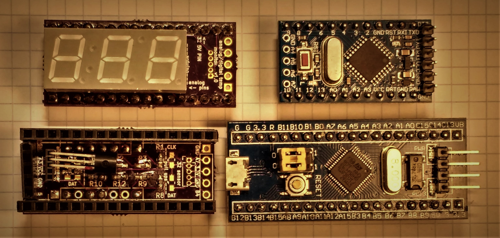
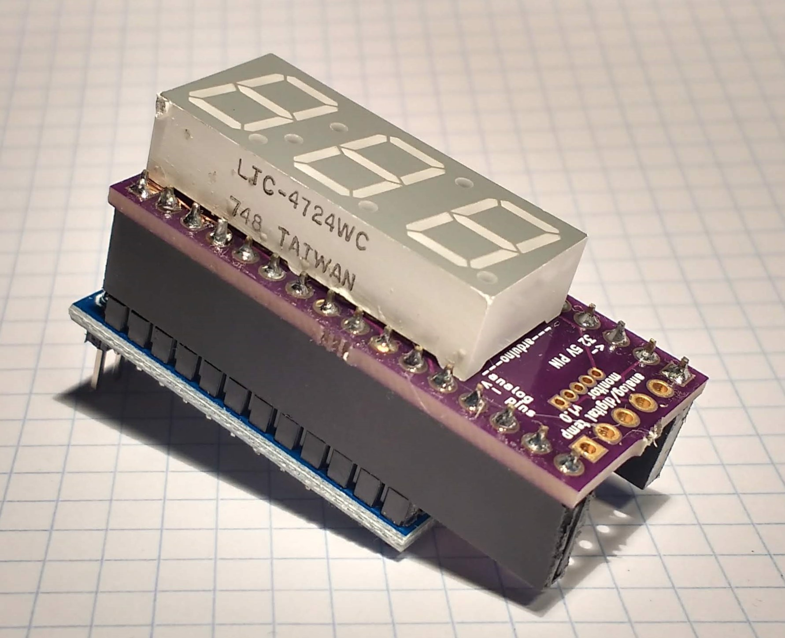
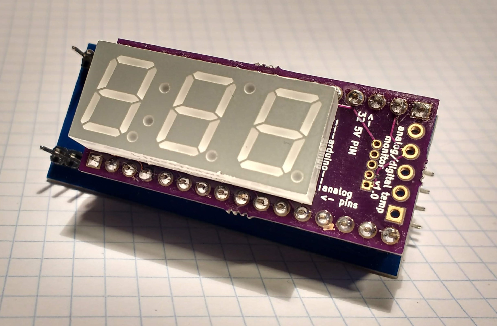

# Temperature Monitor

<iframe id="ytplayer" type="text/html" width="640" height="360" src="https://www.youtube.com/embed/LqRSSkQW6FU?autoplay=0&origin=http://hammeshacks.com" frameborder="0" allowfullscreen></iframe>

# Introduction
The temperature monitor is a shield for an Arduino Pro Mini or a STM32 blue pill. It can read and display information from either an analog or a digital temperatuer sensor. 

# Background

# Assembly

## Component List

* 1 [LTC-4724WC 7 segment display](https://github.com/emilyhammes/emilyhammes.github.io/blob/master/temperaturemonitor/LTC-4724WC-Lite-On.pdf)
* 8 220 ohm 0603 resistors
* Female pinheaders 
* PCB
* Either a STM 32 blue pill or an Arduino Pro Mini
* 1 Temperature sensor

## Soldering together the PCB

1. Solder the 220 ohm resistors onto R1, R2, R3, R4, R8, R9, R10 and R12.
2. Solder the female pinheadders onto the board and trim the leads.
3. Solder the 7 segment display onto the board.

## Pluging In A Sensor and Uploading Code

### Using the Pro Mini 

The shield is longer than the Arduino Pro Mini so some of the pins on the shield will not be connected to the Arduino PCB. To connect the correct pins, look at the front of the shield (the side with the 7 segment display). On the shield there is a dotted line with Arduino written in the middle of it. This is where the arduino will end. Additionally, there is an arrow with analog pins written on it. This lable notes the side where the arduino analog pins plug in.

#### One Wire Sensors

#### Analog Sensors

#### I2C Sensors

### Using the STM32 Blue Pill

The STM 32 blue pill is longer than the temperature shield so some of the blue pill's pins will not be connected to the shield. To connect it correctly, locate the 5V pin on the STM 32. Additionally, locate the pin labled 32 5V PIN on the front of the shield (the side with the 7 segment display). Plug the shield into the STM 32 so that these pins are connected. 

#### One Wire Sensors

#### Analog Sensors

#### I2C Sensors  
