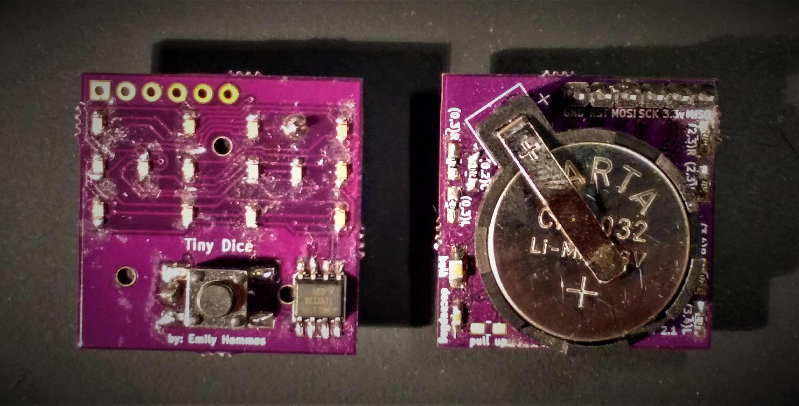
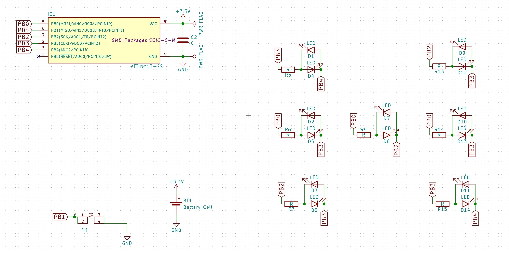
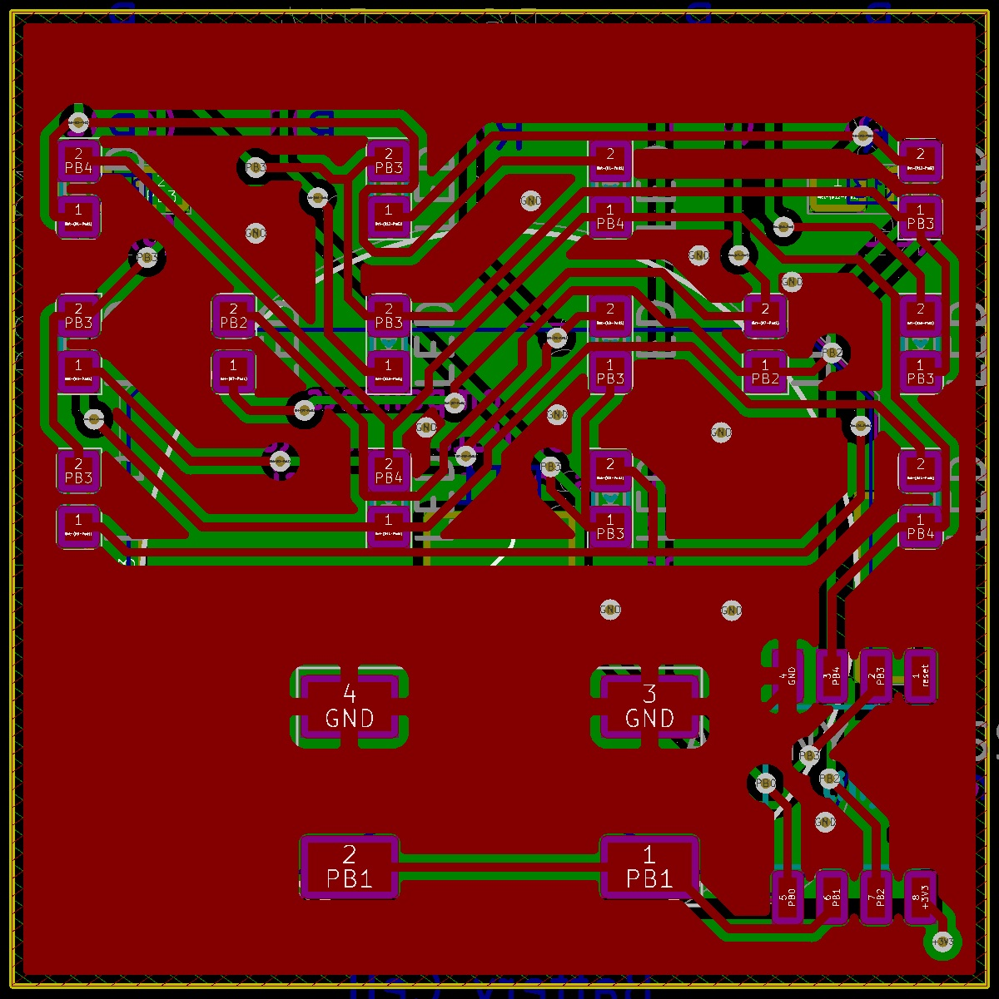
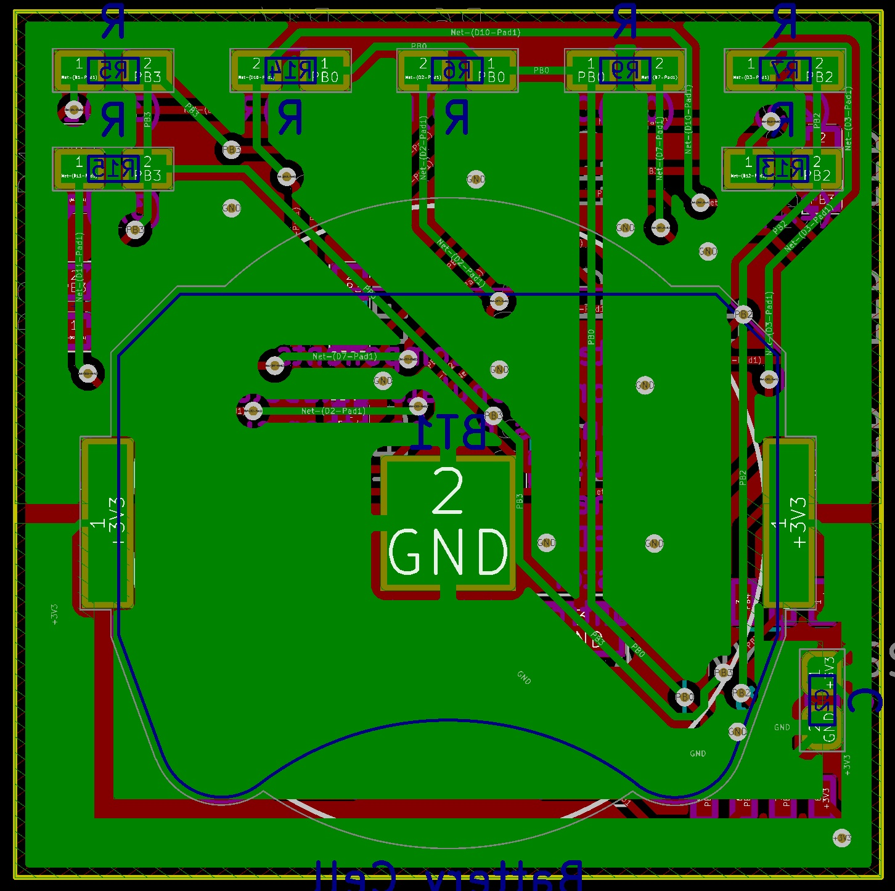

# Tiny Dice

<iframe id="ytplayer" type="text/html" width="640" height="360"
  src="https://www.youtube.com/embed/AgWeJzi1pr0?autoplay=0&origin=http://hammeshacks.com"
  frameborder="0" allowfullscreen></iframe>

## Introduction
The Tiny Dice is a PCB with 14 LEDs which represent 2 dice faces. The LEDS are controlled by an ATTINY 13 using charlieplexing. Code is uploaded to the device with AVR dude using a Bus Pirate, a AVRisp mk II or similar. It is not arduino compatable. Code comes preloaded onto the microcontroller. 

## Theory
The dice are controlled using Charlieplexing:
<iframe id="ytplayer" type="text/html" width="640" height="360"
  src="https://www.youtube.com/embed/Bx5GLyJSWPk?autoplay=0&origin=http://hammeshacks.com"
  frameborder="0" allowfullscreen></iframe>
  
The dice pairs are related in the following way:
<iframe id="ytplayer" type="text/html" width="640" height="360"
  src="https://www.youtube.com/embed/YrsIDrgZ5Qw?autoplay=0&origin=http://hammeshacks.com"
  frameborder="0" allowfullscreen></iframe>

The button uses a pull up resistor:
<iframe id="ytplayer" type="text/html" width="640" height="360"
  src="https://www.youtube.com/embed/C5elus14muQ?autoplay=0&origin=http://hammeshacks.com"
  frameborder="0" allowfullscreen></iframe>

## Soldering The Dice
  
### Materials
  * 7 110 Ohm resistors
  * 1 capacitor 
  * 14 LEDs
  * 1 ATtiny13A
  * 1 button
  * 1 battery holder
  * 1 coin cell battery
  
### To solder the dice follow these steps:

1. Solder on all 14 LEDS paying attention to the LED orientation on the silkscreen.
2. Solder the capacitor onto the PCB.
3. Solder the resistors onto the PCB. 
4. Solder the battery holder onto the PCB.
5. Solder the ATtiny13A onto the PCB.
6. Solder the button onto the PCB.
  
## Uploading Code 
* Code comes pre-uploaded to the ATtiny. [The source can be found on github](https://github.com/emilyhammes/tinydice-firmware).

### Whats Inside the PCB?

This is the schematic of the PCB, showing how all the components are connected.

Above left is a transparent view of the front of the PCB. Above right is the back of the PCB. Green lines are wires on one side and red lines are wires on the other side of the PCB. The text that will be printed on the board is in magenta on one side and teal on the other. The yellow line is the edge of the board. The gold circles are drilled through the board and have copper on both sides. 

