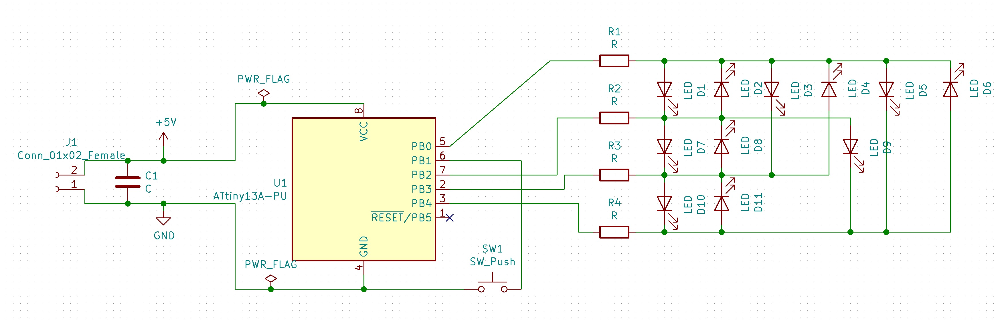
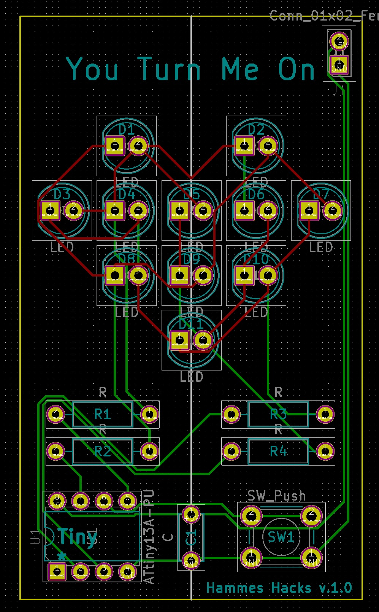

# You Turn Me On

<iframe id="ytplayer" type="text/html" width="640" height="360" src="https://www.youtube.com/embed/NkRfUhv8GNw?autoplay=0&origin=http://hammeshacks.com" frameborder="0" allowfullscreen></iframe>

## Inspiration
At 34C3 I taught a workshop on soldering and programming arduino shields. Many of my students were in relationships with electrical engineers or computer programmers. After the class, many boyfriends and girlfriends of my students were very excited. They came up to me and said, "I have been trying to get my girlfriend to program for years, and last night she spent all night shopping on Aliexpress and adafruit." This kit reminds me of their happiness. 

## Theory

The kit is made of 11 charlieplexed LEDs and a button. When the button is pressed the microcontroller wakes up and displays a pattern. Eventually it falls asleep again.

For more information on how charlieplexing works:

<iframe id="ytplayer" type="text/html" width="640" height="360" src="https://www.youtube.com/embed/Bx5GLyJSWPk?autoplay=0&origin=http://hammeshacks.com" frameborder="0" allowfullscreen></iframe>

For more information on how buttons work:

<iframe id="ytplayer" type="text/html" width="640" height="360" src="https://www.youtube.com/embed/C5elus14muQ?autoplay=0&origin=http://hammeshacks.com" frameborder="0" allowfullscreen></iframe>

## Assembly

<iframe id="ytplayer" type="text/html" width="640" height="360" src="https://www.youtube.com/embed/_cScy0WlOZU?autoplay=0&origin=http://hammeshacks.com" frameborder="0" allowfullscreen></iframe>

### Materials

* 11 5mm LEDs
* 4 resistors
* 1 capacitor
* 1 Attiny
* 1 button
* 1 3 AAA battery holder
* 3 AAA batteries (not included)

### Building the Kit

1. Solder the resistors.
2. Solder the microcontroller making sure that it has the correct orientation.
3. Solder the capacitor.
4. Solder the Button.
5. Solder the LEDS.
6. Trim the leads on the battery holder to length and solder the battery holder. It is important that the wires on the battery holder. are long enough that the batteries can be easily replaced. 
7. Add batteries and check the circuit.
8. If the circuit is ok, hot glue the PCB onto the battery holder.

## Uploading Code

Code comes preuploaded in the kit.

## Whats Inside the PCB?

This is the schematic of the PCB, showing how all the components are connected.

Above is a transparent view of the PCB. Green lines are wires on one side and red lines are wires on the other side of the PCB. The text that will be printed on the board is in magenta on one side and teal on the other. The yellow line is the edge of the board. The gold circles are drilled through the board and have copper on both sides. 
